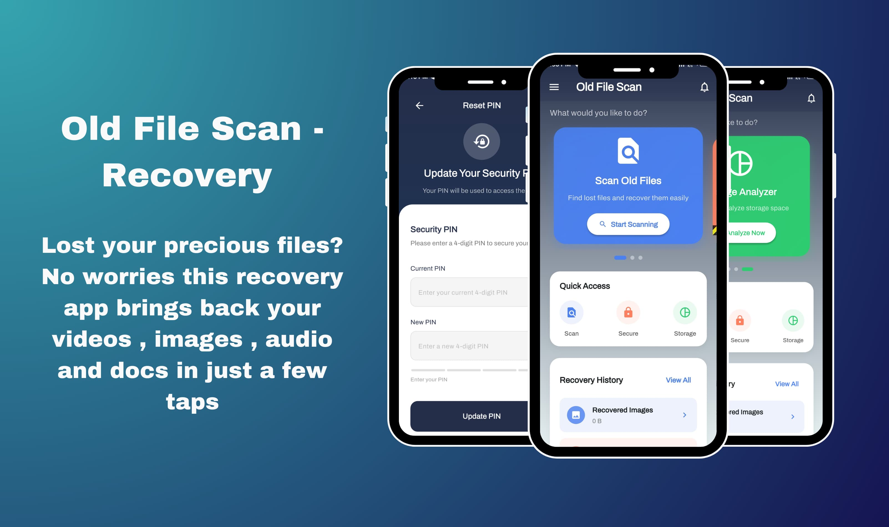
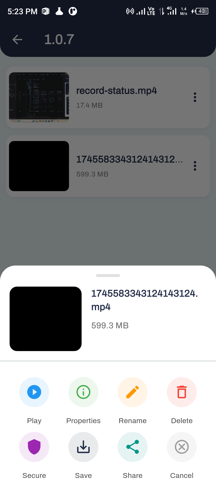
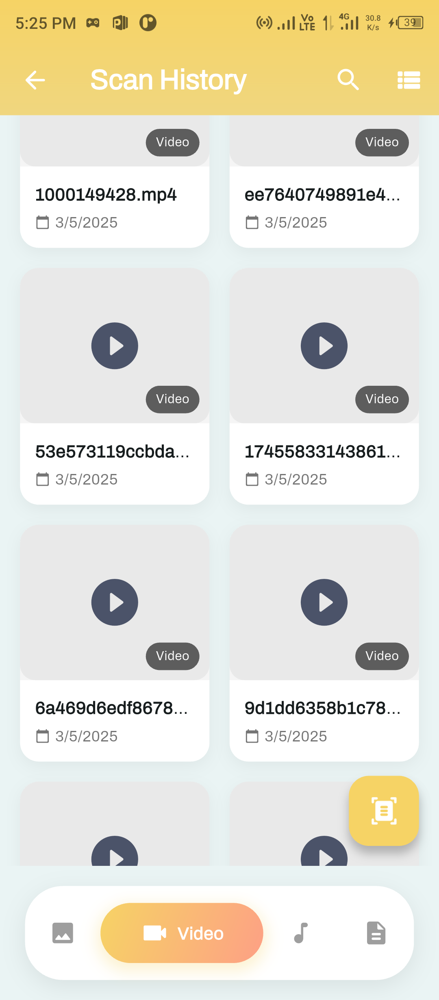
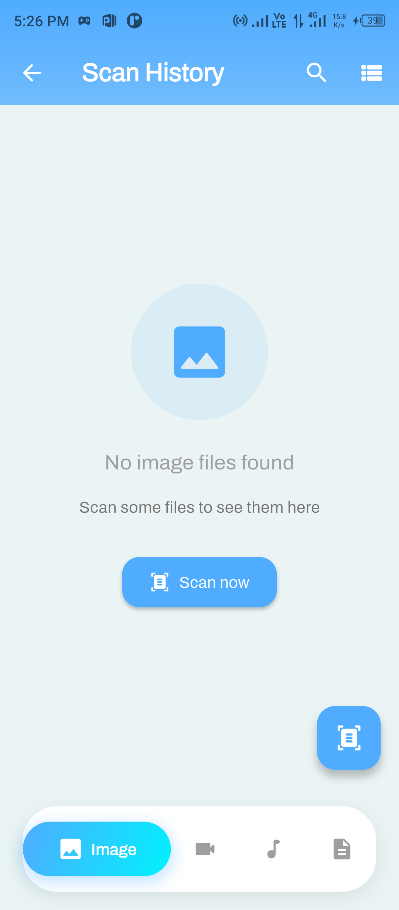
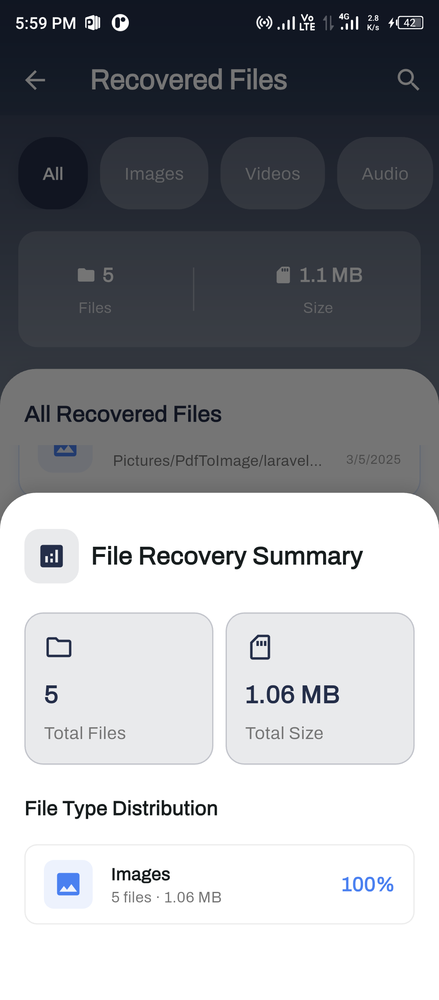
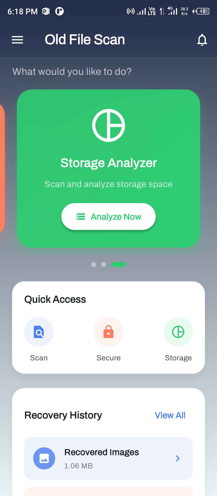
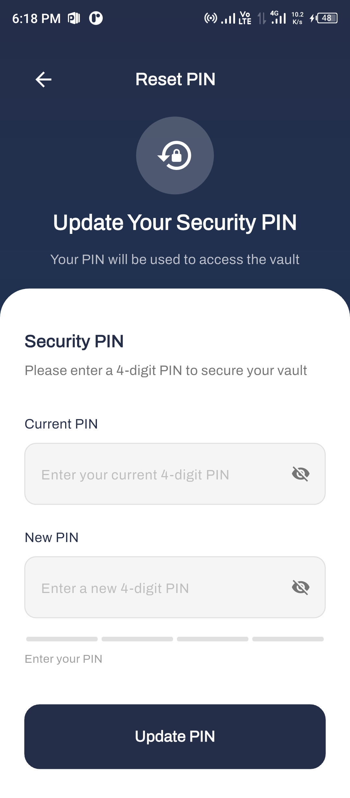

# 🗂️ Old File Scan Recovery

##Old File Scan Recovery## is a privacy-focused Android app for scanning, recovering, and securely managing deleted or lost files (images, videos, audio, documents, and more) from device storage.

---

## 🚀 Features

- 🔍 ##Deep File Recovery##: Scan for deleted files, file fragments, and residual data in both public and system directories.  
- 🧠 ##Multi-Type Support##: Recover images, videos, audio, documents, and more.  
- 🔐 ##Secure Vault##: Encrypt and store sensitive files using advanced AES encryption.  
- 🧭 ##User-Friendly Interface##: Modern UI with folder grouping, previews, and batch recovery.  
- 🔒 ##Privacy First##: All operations are performed locally; no data leaves your device.  
- ⚙️ ##Comprehensive Permissions##: Uses only the permissions needed for effective recovery.

---

## 📲 Getting Started

1. ##Clone the repository:##
````markdown
   ```bash
   git clone https://github.com/your-username/old-file-scan-recovery.git
`````

2. ##Install dependencies:##

   ```bash
   flutter pub get
   ```

3. ##Run the app:##

   ```bash
   flutter run
   ```

---

## 🛠️ Workflow

### 1. Scanning

 Select the file type (images, videos, audio, documents).
 Tap ##"Start Scan"## to begin.
 The app recursively scans storage and groups found files by folder.

### 2. Preview & Recovery

 Browse scan results and preview files.
 Select files and tap ##Recover## to choose a destination.
 Files are copied to a secure app folder (`OldFileManager`).

### 3. Secure Vault

 Move sensitive files to the encrypted vault.
 Files are encrypted using **AES** and accessible only with your password.

---

## 📂 Project Structure

```
lib/
├── main.dart          # App entry point
├── pages/             # Feature modules (audio, docs, vault, privacy, etc.)
android/               # Native Android code
assets/                # App icons, images, and static files
```

---

### 📸 App Screenshots

Below are screenshots of the app in action:
 
<p align="center">
  
  
  
</p>

<p align="center">
  
  
  
</p>

---

## 🔒 Privacy & Permissions

* `MANAGE_EXTERNAL_STORAGE`: Required for deep scanning all directories.
* `READ/WRITE_EXTERNAL_STORAGE`: Access and recover files in public folders.
* **Note:** No data is ever collected or transmitted externally.

---

## 📝 Documentation

 📘 [Help & Support](#)
 📄 [All File Permissions Explained](#)
 📊 [Data Collection Policy](#)

---

## 📧 Support & Feedback

Have questions, issues, or feature requests?
Contact: **[developers.nexquagen.tech@gmail.com](mailto:developers.nexquagen.tech@gmail.com)**

---

## ⚠️ License

This software is for **personal and educational use only**.
**No production, commercial, or public deployment** is allowed without written permission.

See [LICENSE](./LICENSE) for full terms.

---

## 👤 Author

##Muhammad Nouman##
📧 [m.nouman5710@gmail.com](mailto:m.nouman5710@gmail.com)
🔗 [LinkedIn](https://linkedin.com/in/muhammad-nouman-8460b62a3)
💻 [GitHub](https://github.com/muhammadnouman758)

```
